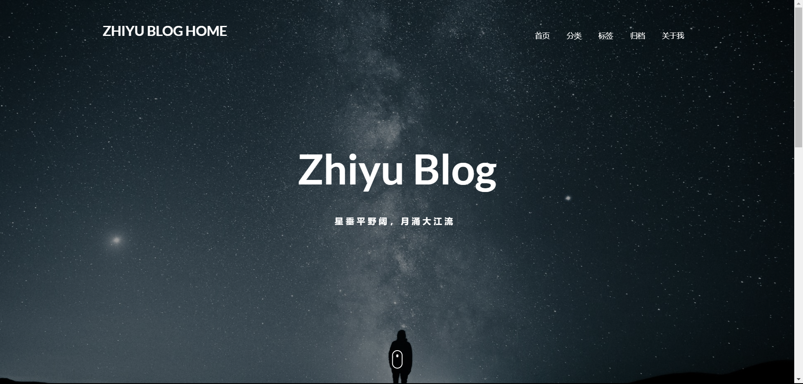
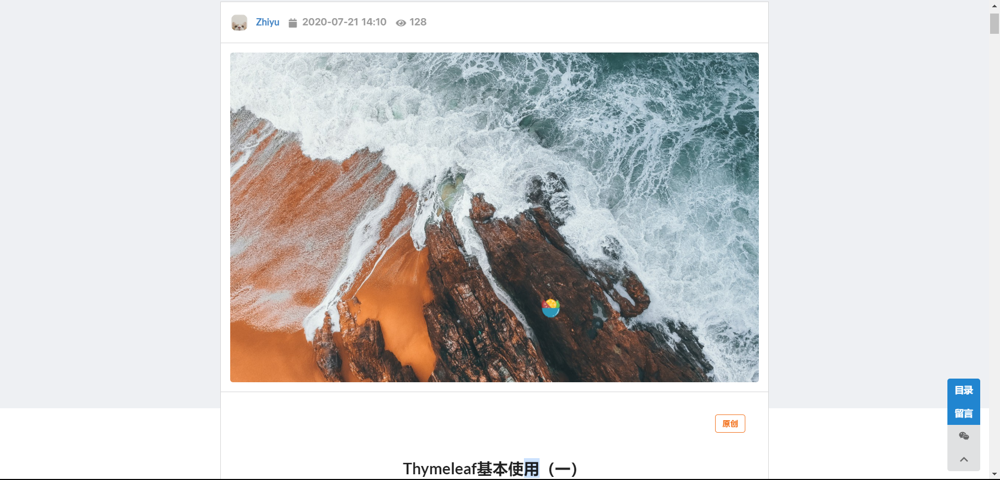
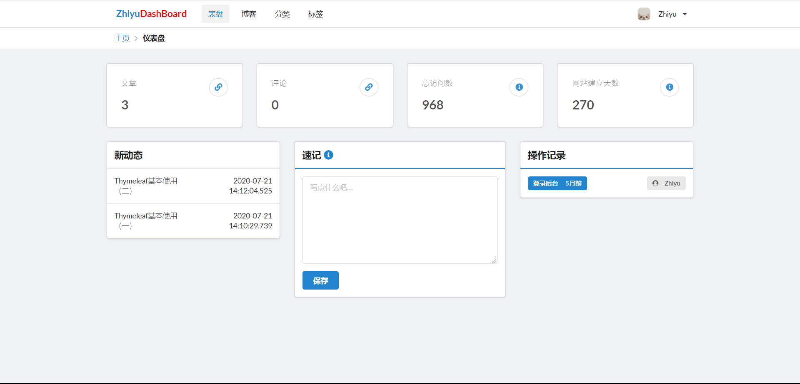
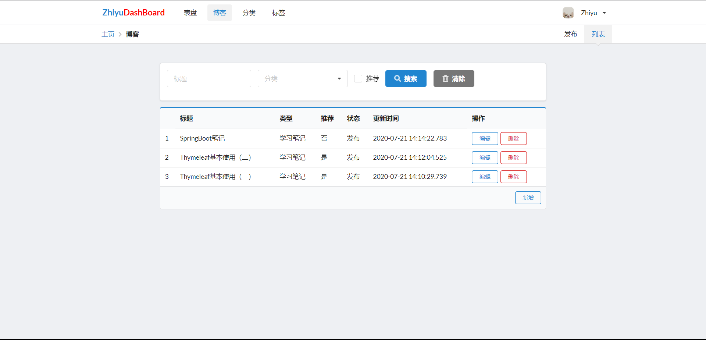
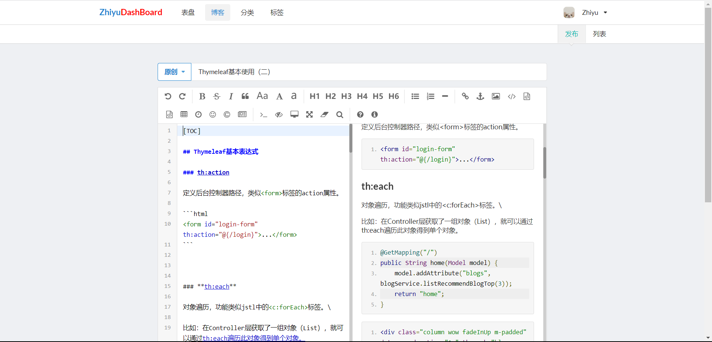

# ZhiyuBlog

------

:bookmark:The ZhiyuBlog that is designed to write some blogs by Java Programming Language for beginner. :rocket:一个JAVA学习型博客项目

技术合集

| Semantic UI | 2.4.1         |
| ----------- | ------------- |
| Spring Boot | 2.2.5.RELEASE |
| Shiro       | 1.4.0         |
| Druid       | 1.1.17        |
| MySQL       | 5.1.47        |
| Thymeleaf   |               |
| Spring JPA  | 2.2.5.RELEASE |

截图：

